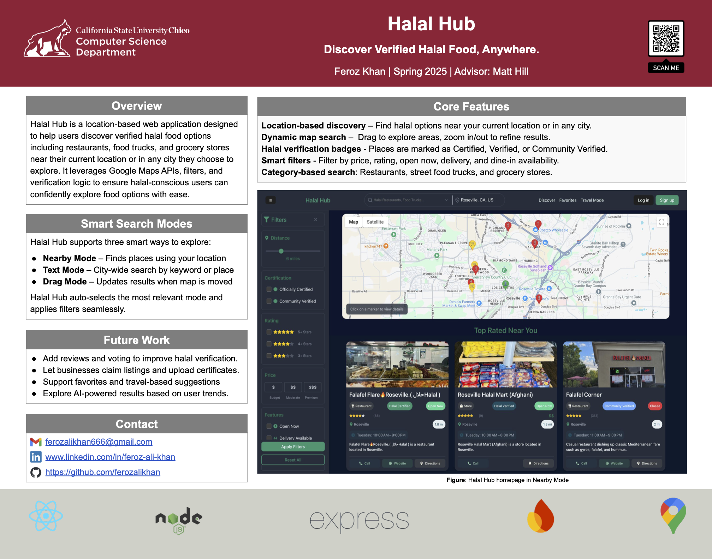

# 🕌 Halal Hub

**Halal Hub** is a full-stack web application that helps users discover verified halal restaurants, food trucks, and grocery stores near them using real-time geolocation, advanced map search modes, and Google Places data. Designed with a user-first approach, Halal Hub supports multiple discovery modes (nearby, drag, and text search), personalized features, and halal verification tools.

---

---
## 🚀 Features

- 🔍 **Search Modes**
  - **Nearby**: Find halal spots near your current location
  - **Drag-to-Search**: Move the map to discover places in a custom area
  - **Text Search**: Explore halal restaurants in any city

- 🗺️ **Interactive Google Map**
  - Marker-based navigation
  - Reverse geocoding for dynamic location updates
  - Geofencing and zoom-level filtering

- ⭐ **Personalized UI**
  - Halal status badges (verified/unverified)
  - Favorites list (coming soon)
  - Filter by categories: Restaurants, Food Trucks, Groceries

- 📦 **Backend**
  - RESTful API with support for location restriction, pagination, and multi-mode filtering
  - Built using Node.js, Express, and Google Places API v1

---

## 🛠️ Tech Stack

**Frontend:**
- React.js
- Google Maps API (via `@vis.gl/react-google-maps`)
- CSS (for styling)

**Backend:**
- Node.js
- Express.js
- Google Places API (Text Search & Nearby Search)
- Firebase (Firestore, Authentication)

**Other Tools:**
- Git & GitHub
- Postman (API testing)
- VS Code
- dotenv (environment config)

---

## 📸 Screenshots

> 

---

## 🧠 Project Goals

- Create a centralized platform for users to **discover halal food options** easily
- Design a modern UX with **real-time map interactions**
- Lay the foundation for user-generated verification and business ownership claims
- Practice full-stack MERN development with professional architecture and modular backend logic

---

